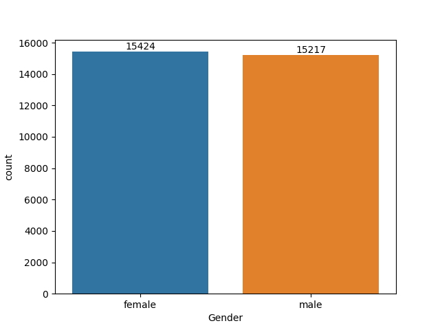
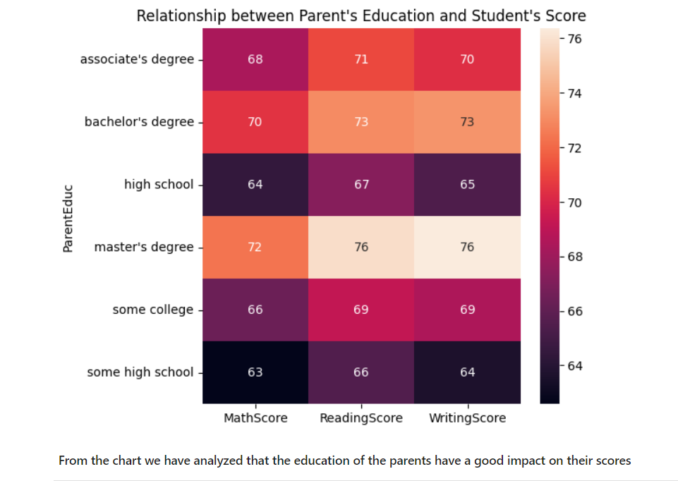
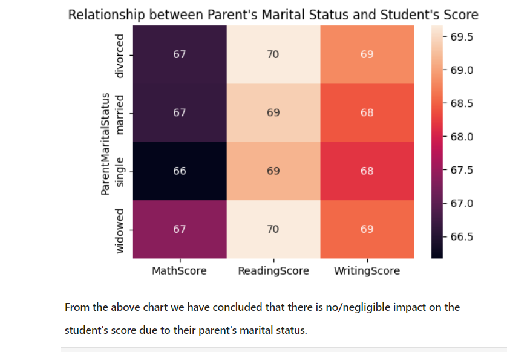
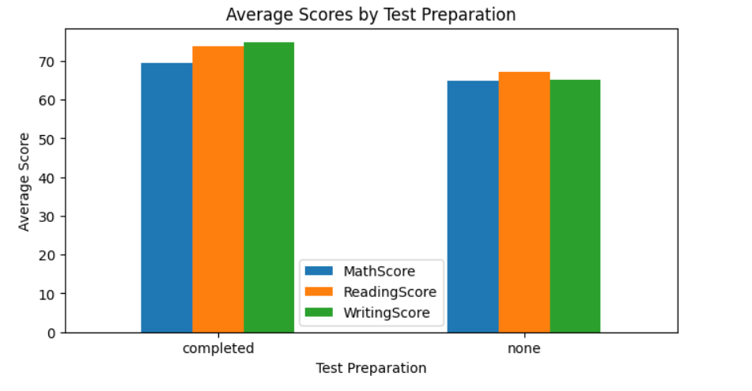
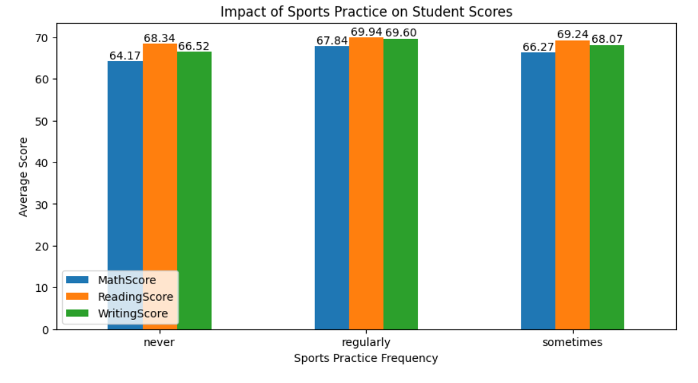
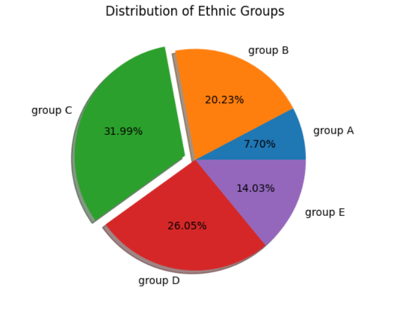
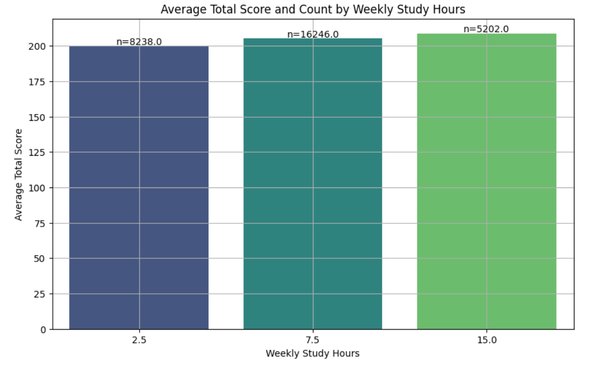

# Student Performance Analysis

This repository contains an analysis of student performance based on various factors such as demographics, parental background, study habits, and participation in extracurricular activities.

## Tech Stack

- **Programming Language**: Python
- **Data Analysis and Visualization Libraries**: Pandas, NumPy, Matplotlib, Seaborn
- **Development Environment**: Jupyter Notebook
## Data Overview

The analysis is conducted using a dataset (`Expanded_data_with_more_features.csv`) containing information on student scores, demographics, and other relevant attributes.

### Initial Data Preparation

Data was loaded from the dataset `Expanded_data_with_more_features.csv`. Columns were cleaned and prepared for analysis, including mapping the format of weekly study hours.

## Visual Analysis

### Gender Distribution

From the analysis, it is observed that the number of females in the dataset is higher than the number of males.

### Impact of Parent's Education on Student Scores

A heatmap visualization reveals a positive relationship between parent's education level and student scores.

### Impact of Parent's Marital Status on Student Score

Analysis shows no significant impact on student scores due to their parent's marital status.

### Test Preparation Program Effectiveness

Students who participated in the test preparation program generally achieved higher average scores in Math, Reading, and Writing compared to those who did not participate.

### Impact of Sports Participation on Academic Performance

Participation in sports correlates positively with academic performance across subjects (Math, Reading, Writing).

### Distribution of Ethnic Groups

A pie chart illustrates the distribution of students across different ethnic groups in the dataset.

### Weekly Study Hours and Total Score Analysis

A bar plot demonstrates the relationship between weekly study hours and average total scores.

## Conclusion

This analysis provides valuable insights into various factors influencing student performance. Key findings include:

- **Parental Education**: Higher levels of parental education are positively correlated with better student performance.
- **Test Preparation Programs**: Participation in test preparation programs is associated with improved scores in Math, Reading, and Writing.
- **Sports Participation**: Engaging in sports activities positively impacts academic performance, highlighting the importance of physical activities for cognitive and academic development.
- **Gender Distribution**: The dataset indicates a higher number of female students, though gender itself was not a significant factor in score variation.
- **Parental Marital Status**: No significant impact was observed on student scores due to parental marital status.
- **Ethnic Group Distribution**: The dataset includes diverse ethnic groups, providing a broad view of student performance across different backgrounds.

For further details and the complete analysis, refer to the Jupyter Notebook (`analysis.ipynb`) in this repository.
